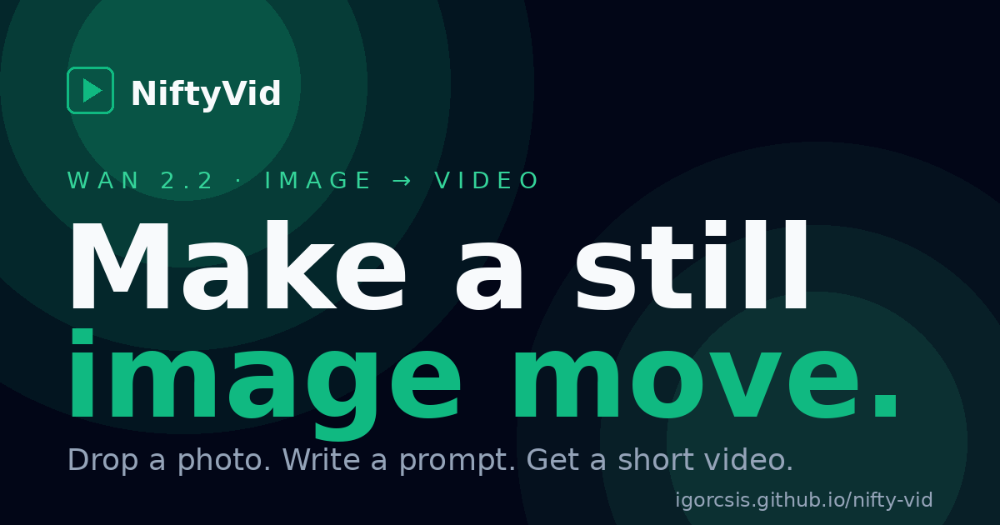

<div align="center">



# NiftyVid

**Animate a still image with Wan 2.2 in your browser. Free. Open source.**

[Live demo](https://igorcsis.github.io/nifty-vid/) · [Portfolio](https://igorcsis.github.io/niftyai-portfolio/) · [Report an issue](https://github.com/IgorCSIS/nifty-vid/issues)


</div>

## What it does

Drop a photo, write a short motion prompt ("slow camera push, leaves drifting"), and a few seconds later you have a short MP4 of that image animated. Under the hood, NiftyVid sends the image and prompt to a public Hugging Face Space running Wan 2.2 image-to-video, the same model class as Runway Gen-3 and Kling, but open source and free to use on a shared GPU.

The site itself is static and hosted on GitHub Pages, so there's nothing to install or sign up for.

## Features

- Drag-and-drop or paste an image straight from the clipboard
- Live prompt with sensible defaults (duration, inference steps)
- In-session history strip with hover-to-preview
- Dark mode interface tuned for long sessions
- Download generated videos as MP4
- Zero tracking, no signup, no API keys to manage
- Friendly error messages that surface upstream queue position and failures

## Tech stack

| Layer | Choice |
|---|---|
| Frontend | Astro 4 + Tailwind 3 + TypeScript |
| Hosting | GitHub Pages (static) |
| Edge proxy | Cloudflare Worker (free tier) |
| Inference | Wan 2.2 image-to-video, on a public Hugging Face Space |
| Tooling | pnpm 11, Wrangler 3, GitHub Actions |

## Architecture

```
[ browser ]  →  [ Cloudflare Worker ]  →  [ HF Space: Wan 2.2 ]
   GH Pages       nifty-vid.workers.dev      public, free GPU
```

The Worker exists for two reasons. Browsers can't reliably call Hugging Face Spaces because of CORS, and we want one stable URL we control so the upstream backend can change without redeploying the static site. Today the Worker proxies to a public Space; tomorrow it could swap to fal.ai, Replicate, or a private Space without touching the frontend.

## Run locally

You need Node 20+, [pnpm](https://pnpm.io/) 11+, and a GitHub clone of this repo.

```powershell
# Frontend (Astro dev server on :4321)
cd web
pnpm install
pnpm dev

# Worker proxy (Wrangler local sandbox on :8787) in a second terminal
cd worker
pnpm install
pnpm wrangler dev
```

Open http://localhost:4321 and try a generation. The frontend reads `PUBLIC_WORKER_URL` from `web/.env`, defaulting to `http://localhost:8787` which matches `wrangler dev`.

## Deploy

The static site auto-deploys to GitHub Pages on every push to `main` via [`.github/workflows/deploy.yml`](.github/workflows/deploy.yml). The Worker is deployed manually with Wrangler:

```powershell
cd worker
pnpm wrangler login
pnpm wrangler deploy
```

After the first Worker deploy, set the resulting URL as a `PUBLIC_WORKER_URL` repository variable under **Settings → Secrets and variables → Actions → Variables**. The next Pages build will wire the frontend to your production Worker.

## Limitations

- Wan 2.2 caps generations at about 5 seconds at ~720p. Long shots and complex multi-character scenes are out of scope.
- The free HF Space is shared, so first calls cold-start (60 to 120 seconds) and peak hours queue up.
- The upstream Space could change or disappear. If it does, the Worker's `HF_SPACE_BASE` env var is the only line to update.
- Workers free tier has wall-clock limits that occasionally clip very long generations. Retry usually works.

## Roadmap

- [ ] Streaming SSE for live progress updates in the UI
- [ ] Optional second keyframe ("last frame") for guided motion
- [ ] Saved generations across sessions (opt-in localStorage)
- [ ] Frame extraction tool to use a generated frame as the next input
- [ ] Swap-able backend: fal.ai for users with API keys

## Credits

- [Wan 2.2](https://huggingface.co/Wan-AI/Wan2.2-I2V-A14B-Diffusers) by Alibaba Tongyi Lab
- The [`cbensimon/wan2-2-fp8da-aoti-preview2`](https://huggingface.co/spaces/cbensimon/wan2-2-fp8da-aoti-preview2) Hugging Face Space that hosts the inference
- [Astro](https://astro.build/), [Tailwind](https://tailwindcss.com/), and [Cloudflare Workers](https://workers.cloudflare.com/) for the boring-but-good parts

## License

MIT. See [LICENSE](LICENSE) if present, otherwise consider this repo MIT until I add the file.

---

Part of the [**NiftyAi**](https://github.com/IgorCSIS/niftyai-portfolio) project family by [Igor Lima](https://github.com/IgorCSIS). Companion to [NiftyStats](https://github.com/IgorCSIS/niftystats).
